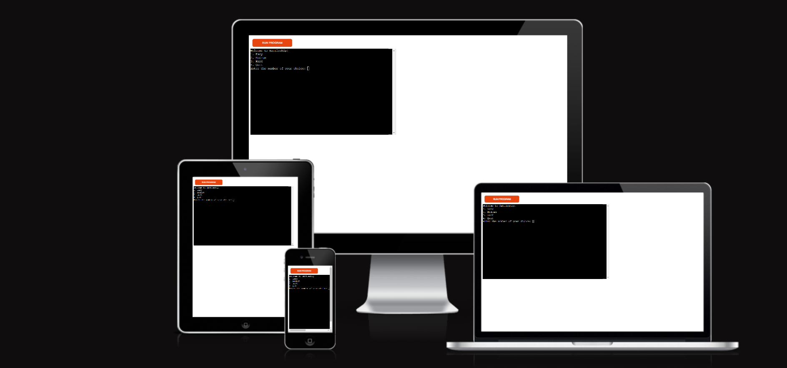
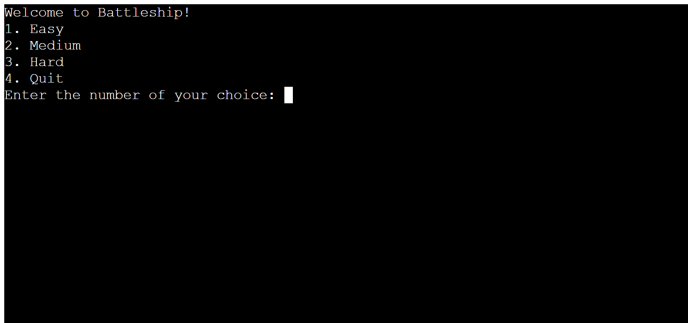
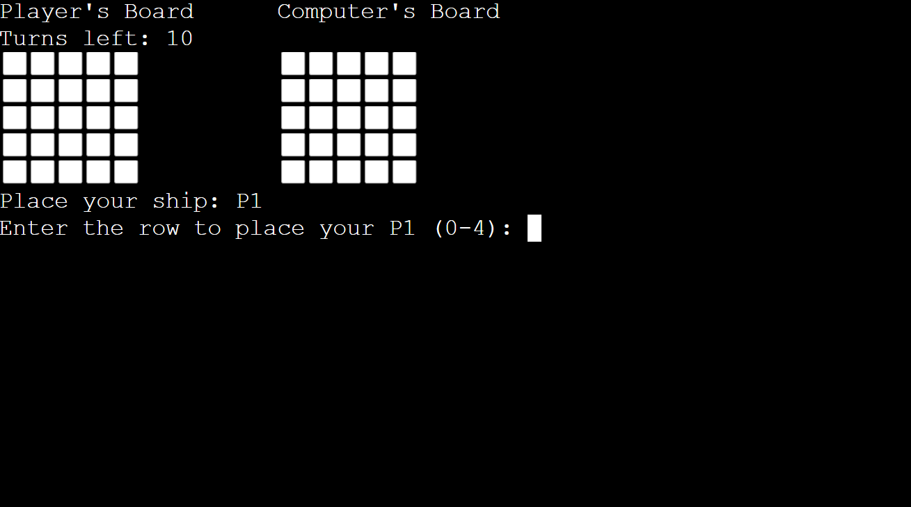
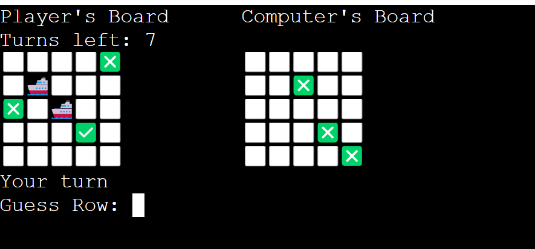
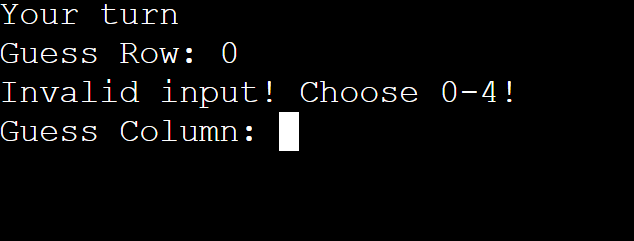
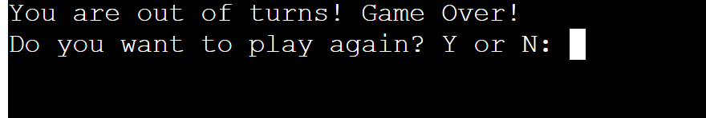

# Battleship
[Battleship](https://battleship-game-project3-826e2c910f96.herokuapp.com/) is a Python-based terminal application that allows users to play the classic game of Battleship. Challenge your strategic skills and defeat your opponent in a game of naval warfare!

It is played against a computer opponent in the Code Institute mock terminal on Heroku.

## How to play:

- The game is played on a 5x5 grid.
- The game has a choice of three difficulty levels for the player to decide on.
- The player places their battleships on the board by entering coordinates.
- The computer opponent will then place their ships.
- Take turns to guess your opponent's ship locations by specifying row and column.
- If your guess is a miss, the corresponding position on the guess board will show "❎".
- If your guess is a hit, the corresponding position on the guess board will show "✅".
- The game ends when either you or the AI destroys all the opponent's ships, or you run out of turns.

### Features
- #### Existing Features

- ##### Difficulty menu.
The game offers players the option to choose from different difficulty levels to tailor their gaming experience: Easy(10 Turns), Medium(8 Turns) and Hard(6 turns)

- ##### Manual Ship Placement.
The player places their ships on their board by entering a number from 0-4 for both row and column.

- ##### Computer Opponent.
The player plays against a computer opponent who randomly places their ships on the computer board.

- ##### Visually engaging boards.
The boards are made using emojis, to make it more visually appealing. The icons for ships, hits and misses also use emoji.

- ##### Input validation.
The game checks for valid inputs, such as ensuring that row and column coordinates provided by the player are within the allowable game board range (0-4). This prevents accidental or intentional entry of invalid data. It does the same for difficulty choice and guesses.

- ##### Exit manu.
At the end of the game the player has the choice to play again or exit the game.

- #### Future Features
- Allow the option to choose board size.
- Allow the the option for more ships.
- Have ships that take up more than one space on the board.

### Testing
The application was tested manually during the whole development process. On both the IDE used and Heroku.

#### Manual Testing
- ##### Difficulty menu.
- All four options on the difficulty menu I manually tested and all four work as intended.
- ##### Manual Ship Placement.
- Tested to make sure all invalid inputs are handled correctly and correct inputs are working as intended.
- ##### Win Conditions
- Tested both player win scenario and computer win scenario and both work as intended.
- #### Player Guesses
- Test player input for guesses to make sure both valid and invalid inputs are handled correctly.
- ##### Exit manu.
- The exit menu has been tested for both play again and exit options and both work as intended.

#### Validator Testing:
- No errors were returned from the PEP8 validator.

#### Bugs:
### Solved Bugs
- Found a bug were row 4 of the board was deemed an invalid input.
- I fixed it by adjusting the range allowed when entering inputs. 

### Remaining Bugs
-None.
